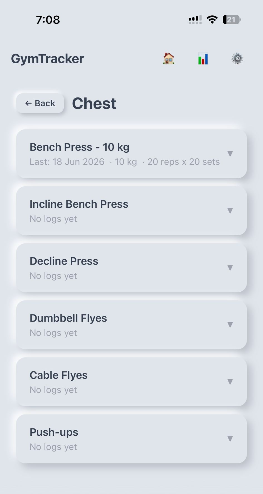
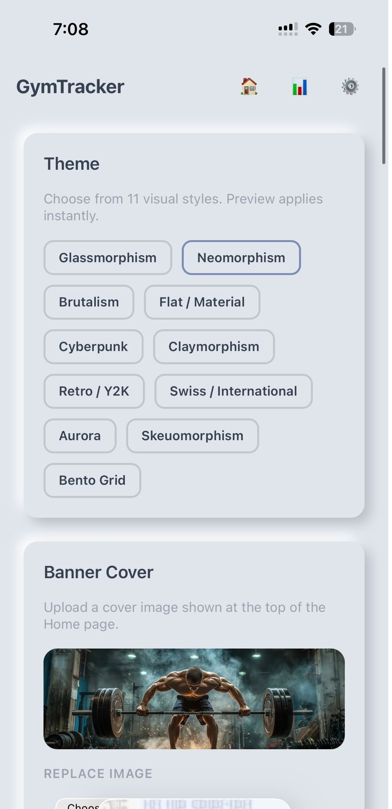
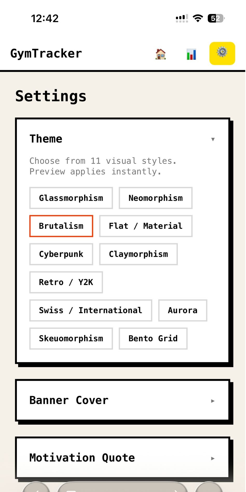
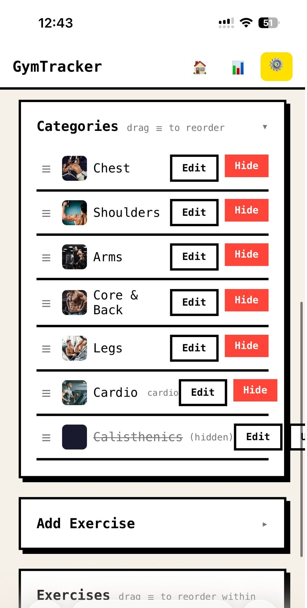
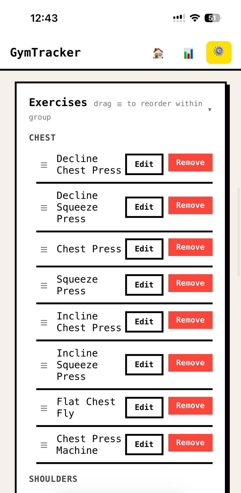

# GymTracker

A simple personal gym workout tracker built for my own use. Written with [Claude Code](https://claude.ai/code) — not feature-rich, just what I personally needed to track dumbbell and machine weights.

## What it does

- Track workouts by category (Chest, Shoulders, Arms, Core & Back, Legs, Cardio, Calisthenics)
- Log weight, reps and sets for strength exercises
- Log distance, duration and auto-calculates speed for cardio
- Shows your last entry when you open an exercise so you know where you left off
- Analytics page with weekly volume chart and weight progress over time
- Works offline - logs sync when you're back online
- 11 visual themes to pick from
- Upload a banner image and set a motivation quote on the home page
- Export and import your settings and workout logs as CSV (for backup)
- Reset everything back to defaults if needed

## Setup

Requirements: Python 3.11+

```bash
# 1. Create virtual environment and install
python -m venv .venv
.venv\Scripts\python.exe -m pip install django pillow

# 2. Set up the database
.venv\Scripts\python.exe manage.py migrate

# 3. Run
.venv\Scripts\python.exe manage.py runserver
```

Open http://127.0.0.1:8000 in your browser. No accounts, no login, single user only.

> All data is stored locally in `db.sqlite3`. To back up: Settings > Data / Backup > Export CSV.

---

## Screenshots

**1. Home** — Category grid with your banner image and motivation quote.


---

**2. Exercises** — Tap a category to see all exercises. Shows your last logged weight, reps and sets.



---

**3. Settings — Theme & Banner** — Pick from 11 visual themes. Upload a custom banner image.



---

**4. Settings — Theme Picker** — Choose a style. Preview applies instantly.



---

**5. Settings — Categories** — Manage categories. Drag to reorder, hide ones you don't use.



---

**6. Settings — Exercises** — Manage exercises grouped by category. Drag to reorder within each group.



---

Written with [Claude Code](https://claude.ai/code) for personal use.
